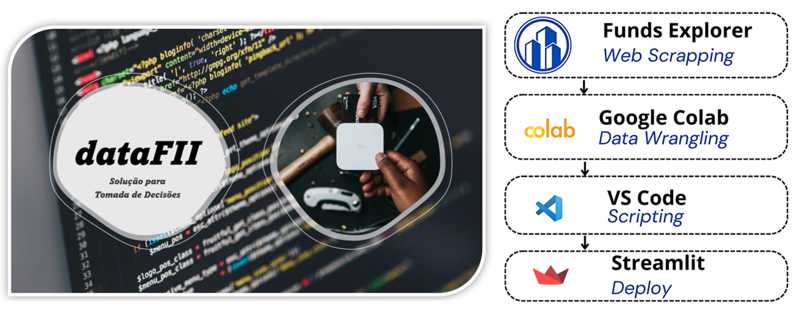

# Data-driven solution for Brazilian Real Estate Investment Funds (FIIs)

The project depolyed a data-driven solution for analyzing and getting opportunities of Brazilian Real Estate Investment Funds (known as FIIs from Brazilian portuguese - Fundos de Investimento Imobiliário). The deployed web-app has two main functionalities: 

> ***(i)** an interactive ranking of FIIs*; 

> ***(ii)** an opportunity filter for FIIs that is based on a sector-related strategy*.

The active prices and indicator is updated on a daily basis. Hence, the FIIs solution could be used to assist in strategic investment decisions.

FIIs data-driven solution: [DataFII](https://oviedovr-pyfii-deploy-datafii-yujp93.streamlitapp.com/)
Video explanation: [A brief talk](https://www.youtube.com/)

